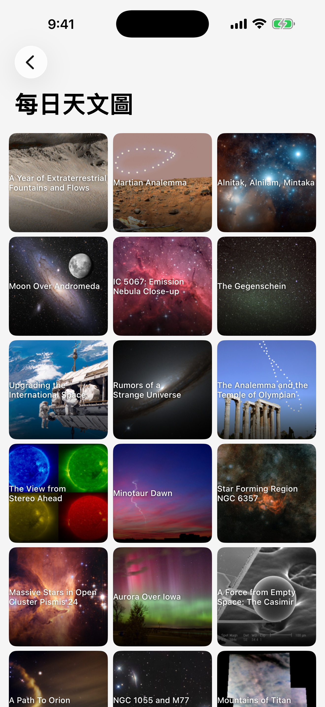
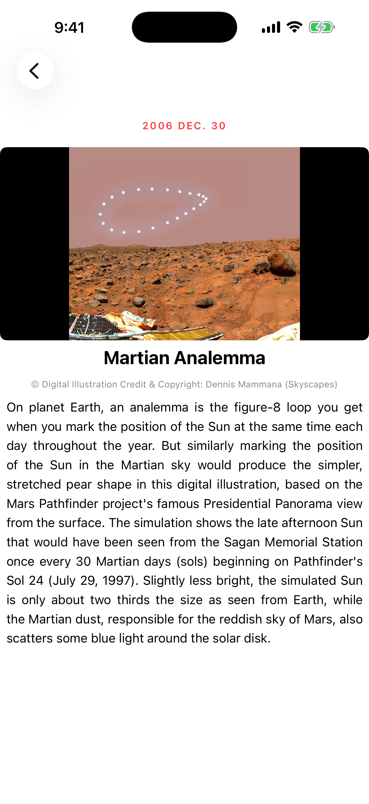

<p align="center">
  
</p>

<h1 align="center">Stellar</h1>

<p align="center">
  iOS app for browsing NASA's Astronomy Picture of the Day.<br/>
  Swift &middot; UIKit &middot; MVVM
</p>

從 [NASA APOD](https://apod.nasa.gov/apod/astropix.html) 資料集顯示每日天文圖。首頁進入縮圖牆，點圖看詳情（高解析圖 + 標題 + 日期 + 版權 + 描述）。


---

## 截圖

| 首頁 | 縮圖牆 | 詳情頁 |
|---|---|---|
|  |  |  |

> 截圖檔案放在 `docs/screenshots/` 下，目前為 placeholder，待補。

---

## 功能

- 從遠端 JSON 抓取 NASA APOD 清單
- 縮圖牆：3 欄正方形 cell、圓角卡片、底部漸層遮罩 + 白色標題
- 詳情頁:大圖（aspect fit + 黑底）、日期 caption、標題、版權、描述（含行距 + 動態 row height，長描述可捲動）
- 圖片載入：背景下載 + `NSCache` 記憶體快取 + `URLCache` HTTP 快取 + ImageIO downsample（避免高解析原圖吃光記憶體）
- cell 重用時取消上一張下載任務，避免「晚到的圖蓋掉新 cell」

---

## 環境需求

| 項目 | 版本 |
|---|---|
| Xcode | 12.5+ |
| iOS Deployment Target | 14.5 |
| Swift | 5.0 |

無第三方套件，純 UIKit。

---

## 怎麼跑

```bash
git clone https://github.com/cowton0627/NewPjt_07.git
cd NewPjt_07
open NewPjt_07/NewPjt_07.xcodeproj
```

在 Xcode 內按 ⌘R 編譯並執行（模擬器或實機皆可）。首次執行會從遠端抓 JSON 與圖片，需要網路。

---

## 專案結構

```
NewPjt_07/NewPjt_07/
├── AppDelegate.swift
├── SceneDelegate.swift
├── Info.plist
├── Assets.xcassets/
├── Base.lproj/
│   ├── LaunchScreen.storyboard
│   └── Main.storyboard
├── Models/
│   └── Astro.swift                       # 資料模型
├── Services/
│   ├── AstroService.swift                # API + JSON 解碼
│   └── ImageLoader.swift                 # 圖片下載 / 快取 / downsample
├── ViewModels/
│   ├── AstroListViewModel.swift          # 縮圖牆狀態 + fetch + binding
│   ├── AstroCellViewModel.swift          # 單格 cell 顯示資料
│   └── AstroDetailViewModel.swift        # 詳情頁顯示資料 + 文字呈現邏輯
└── Views/
    ├── ViewController.swift              # 首頁
    ├── AstroCollectionViewController.swift
    ├── AstroCollectionCell.swift
    ├── DetailViewController.swift
    └── DetailViewCell.swift
```

### MVVM 流程

```
ViewController (首頁)
    └─ segue ─► AstroCollectionViewController
                    │  持有 AstroListViewModel
                    │     ├─ 呼叫 AstroService.fetchAstros
                    │     └─ 透過 closure 通知 View reload
                    │
                    └─ segue ─► DetailViewController
                                   持有 AstroDetailViewModel
                                   （上一頁注入；裡面持有單一 Astro）
```

View → 透過 ViewModel 取資料、註冊 closure binding
ViewModel → 呼叫 Service、整理顯示用資料、發 callback 通知 View
Service → 純資料來源，主線程回呼

---

## 資料來源

[cmmobile/NasaDataSet](https://github.com/cmmobile/NasaDataSet) 提供的 `apod.json`，由 NASA APOD 整理而來。
